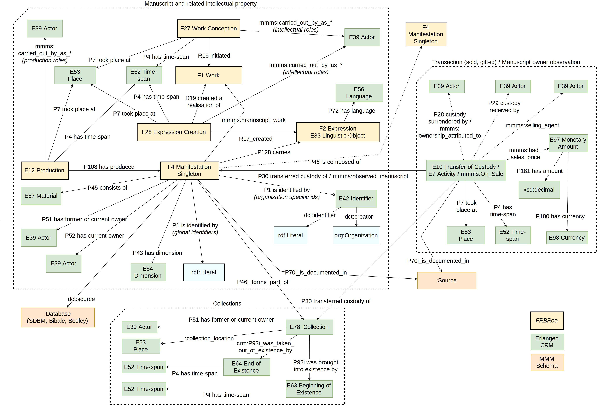
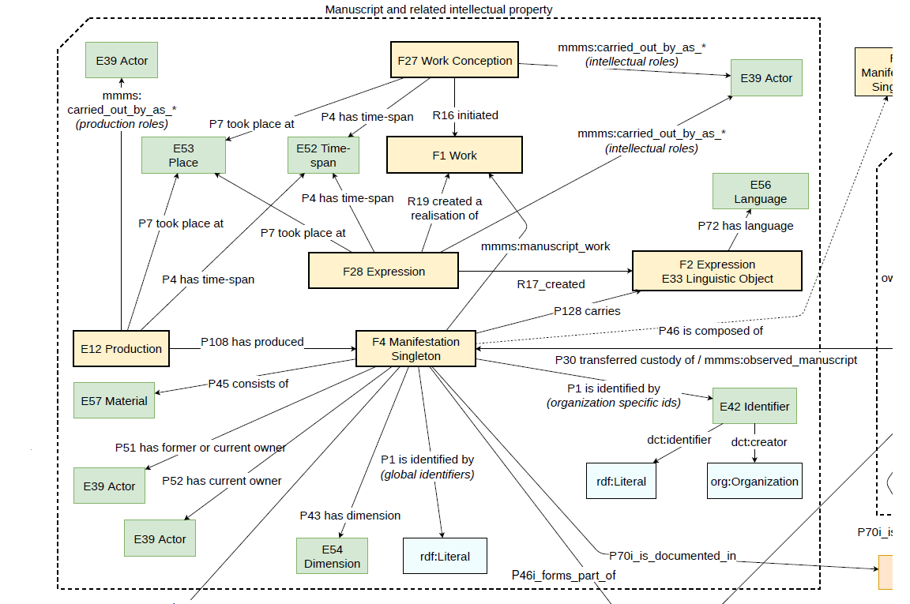
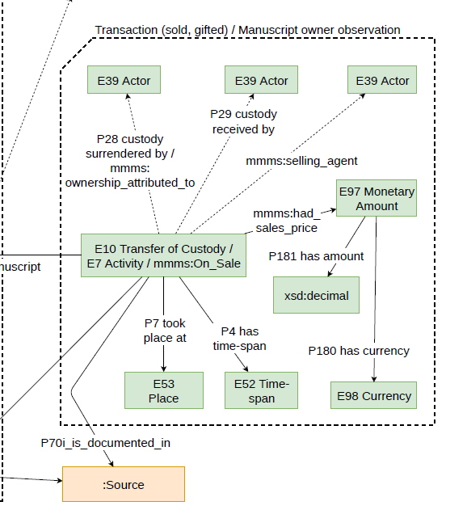
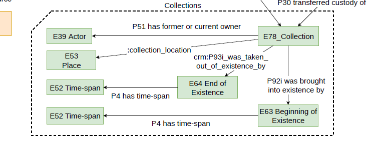

## MMM Data Model

The MMM data model serves the needs of this project, but its components and design will be of interest for anyone concerned with modeling manuscript provenance data. It incorporates concepts from a variety of existing ontologies, including Erlangen CIDOC-CRM for events, FRBRoo for bibliographic information, and the Getty Thesaurus of Geographic Names for physical locations. We also created bespoke MMM classes and properties that serve both unique instances in our source datasets and manuscript studies more generally. The data model is clustered into three main sections, indicated by the dotted lines within the diagram: manuscripts and related intellectual activity; transaction/manuscript owner observations; and collections. The entire [MMM Schema](/mapping-manuscript-migrations.github.io/data_model/mmm-schema) is available on this site, and a downloadable image of the data model is available [here](/mapping-manuscript-migrations.github.io/data_model/MMMdatamodel.pdf).

  

<br>
### Data Model sections

##### Manuscripts and related intellectual activity

The largest section revolves around manuscripts themselves, including data about when and where they were produced, the works they contain, and descriptions of their physical characteristics. At its center is the ```F4 Manifestation Singleton``` class, which is FRBRoo's conception of what a manuscript is: both a unique item and an instance of a manifestation, as understood in FRBR's work-expression-manifestation-item hierarchy.


<br>
##### Transaction (sold/gifted)/Manuscript owner observation

This section deals with various types of ownership events. We use different classes to capture this information, depending on whether we know an event transferred ownership from one actor to another (```E10 Transfer of Custody```), if a manuscript was listed for sale but we don't know who bought it (```mmms:On_Sale```), or if we only know that an actor possessed a manuscript (```E7 Activity```). These ownership events link directly to their associated manuscripts via the ```P30 transferred custody of``` and ```mmms:observed_manuscript``` properties.


<br>
##### Collections

Data about manuscript collections map to the ```E78 Collection``` class. Collections link to the people who owned them, the places they were located, and the dates that they were formed and dissolved. Individual manuscripts link to the Collection class via the ```P46i forms part of``` property. Transaction events can also pertain to collections, and link to them via the ```P30 transferred custody of``` property.

