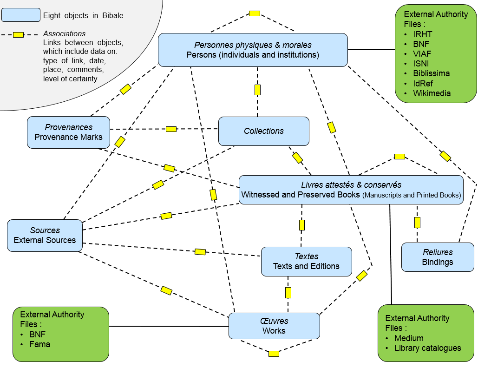

### BIBALE: [http://bibale.irht.cnrs.fr/](http://bibale.irht.cnrs.fr/)
_BIBALE_ stands for Bib[liothèque médiév]ale. It is the database of the long-term project of the Codicological Section of the IRHT (Institut de recherche et d’histoire des textes) in Paris. The database describes medieval libraries as well as modern and contemporary libraries containing medieval books. It allows to search and reconstruct the provenance of medieval manuscripts. Bibale does so in order to support research on the history and the circulation of texts. Data is being entered in Bibale since 2012, mainly from the Provenance Card Index of the IRHT (350.000 to 400.000 cards) built up between 1940 and 2005. Since 2015 a collaborative project coordinated by a group of French libraries aims Bibale to become the national French database for the provenance of books, manuscripts and printed books.

The development of Bibale and the data entering have been made possible by the [Institut de recherche et d’histoire des textes (IRHT-CNRS)](https://www.irht.cnrs.fr/?q=fr/agenda/du-manuscrit-l-incunable-initiation-au-texte-medieval-et-renaissant), the [Biblifram](http://www.libraria.fr/fr/biblifram/le-projet-biblifram) project (2009-2013), the [Biblissima](https://projet.biblissima.fr/) project (2012-2019) and the [Mapping Manuscript Migrations (MMM)](http://mappingmanuscriptmigrations.org/) project (2017-2020).

All Bibale records belong to one of eight objects. Any record can be associated as many times as wished for with any other record (including one belonging to the same object, e.g. a person with another person to say that they are father and son; a manuscript with another manuscript to say that they were once bound together or have been copied one from the other; a work to another work to say that one is a translation of the other; etc.).  

To date (August 2019) Bibale contains about 39.000 records:  
* 10.500 persons (about 2.000 of which are institutions)
* 2.000 collections (private or public libraries)
* 12.000 books (almost all manuscripts, some printed books)
* 700 bindings
* 10.000 provenance marks (ex-librises, ex-donos, heraldic arms, etc.)
* 500 external sources (ancient catalogues, inventories, lists, etc.)
* 1.250 texts or editions (the version of a text found in a specific manuscript)
* 2.000 works

All records, all fields and all associations can be provided with a “level of certainty”:
* green = certain
*	orange = not so sure, uncertain
*	red = rejected
This means that, for example, a manuscript linked by an association “owned by/in the possession of” with a person can be so for sure, but also just possibly, and even indicated in red. In the last case this will usually be explained in the comment field, e.g. an ownership relation has been supposed in the past, but rejected since.

[Online presentation](https://www.youtube.com/watch?v=adQkMtYRChc&t=8s) in French (25 minutes).
