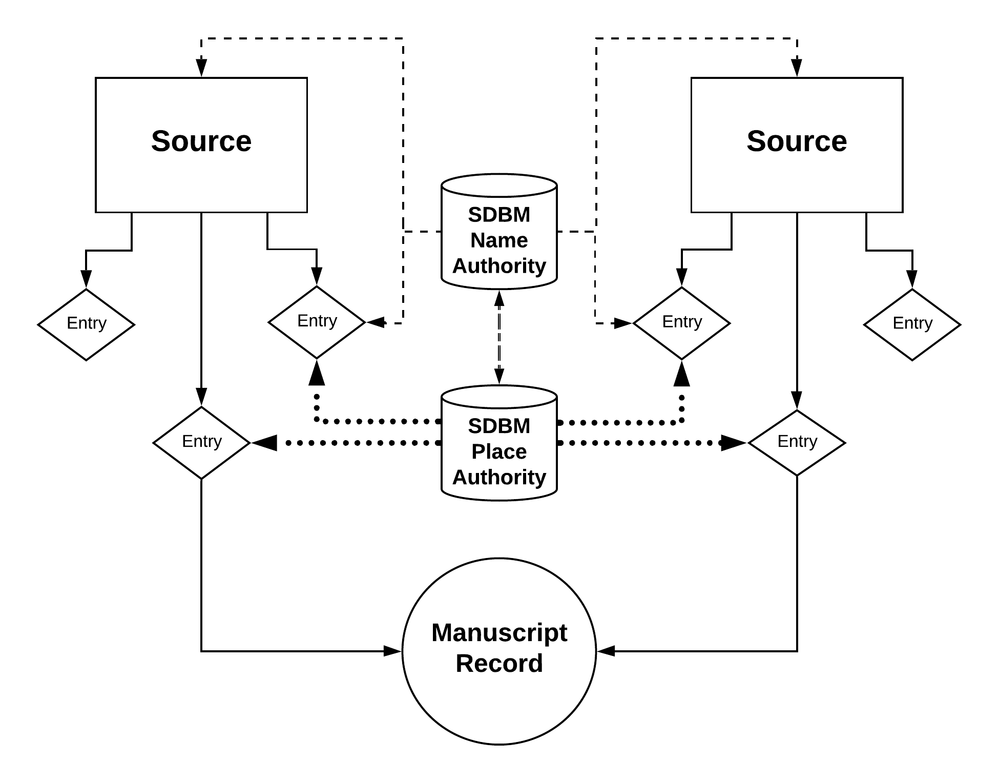

## MMM Contributing Datasets

The MMM project mapped and transformed three separate datasets against the unified MMM data model. This section introduces these sources: the Schoenberg Database of Manuscripts (SDBM), Bibale, and the Medieval Manuscripts in Oxford Libraries catalogue. Each dataset's original structure and format impacted the development and implementation of the MMM data model.

### Schoenberg Database of Manuscripts (SDBM)

The SDBM aggregates observations of pre-modern manuscripts drawn from over 13,500 auction and sales catalogs, inventories, catalogs from institutional and private collections, and other sources that document the sales and locations of these books from around the world. Using 36 possible fields, entries in the SDBM record data from observations made in these sources and assist researchers in locating and identifying particular manuscripts, establishing provenance, and aggregating descriptive information about specific manuscripts as they are described in various sources over time. The SDBM data is stored in a MySQL relational database, with Ruby on Rails providing the overall web framework. Blacklight provides front end display support for public searching. The SDBM is hosted by the University of Pennsylvania Libraries and is publicly available [here](https://sdbm.library.upenn.edu/).

#### SDBM Data model

The SDBM's data model is designed to capture data about both manuscripts and the sources that describe them.

**Sources** describe manuscripts, such as auction catalogs, bookseller websites, etc.

**Entries** represent observations of manuscripts derived from a Source, such as a single lot from an auction catalog, or a single item in a library catalog.

**Manuscript Records** link together Entries that describe the same manuscript, so that you can easily compare different descriptions of the same manuscript over time.

**SDBM Name Authority files** govern fields related to persons and institutions who impacted the production or provenance history of a manuscript, including authors, scribes, artists, owners (both individual persons and institutions), and selling agents. When possible, SDBM Name Authority files include links to VIAF. The Names can also link to SDBM Place Authority files, indicating the places where a person lived or the location of an institution.

**SDBM Place Authority files** appear within an Entry to indicate where a manuscript was produced. These files link to the Getty Thesaurus of Geographic Names, GeoNames, or VIAF, when possible. SDBM Places also link to SDBM Name Authority files.

#### SDBM to MMM transformation pipeline

Coming soon!

#### Mapping of an SDBM Entry into MMM

Coming soon!
