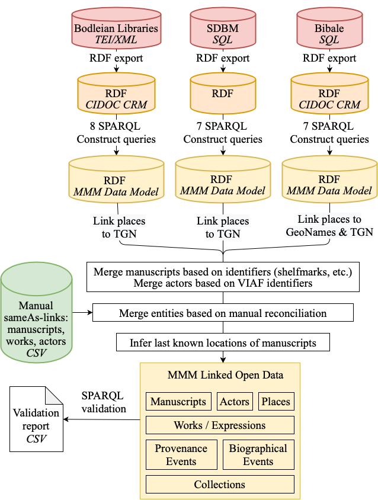

## Data Transformation Pipeline

A repeatable automatic data transformation pipeline (<a>https://github.com/mapping-manuscript-migrations/mmm-data-conversion</a>) was developed to (re-)create the whole MMM knowledge graph from the source databases. This enables updating the MMM knowledge graph regularly with new changes from the source databases.

The pipeline takes the RDF exports of the source databases as input and first transforms these into the MMM data model using a total of 22 SPARQL Construct queries. The queries reinterpret the information in the source databases in the terms of the MMM data model.

After the databases are transformed into using the MMM data model, various processes are used to disambiguate and reconcile a portion of the entities shared between them.

Automatic processes match 589 actors between the databases based on their VIAF identifiers. 3525 matches between manuscripts are found by matching based on shelfmark identifiers parsed from the manuscript metadata (3170) and Phillipps Numbers (355). In addition to the automatic matching, domain experts searched for matching entities between the databases. This yielded matches between 3136 actors, 1067 works, and 80 manuscripts.

The matching entities between are reconciled by merging the entities and their metadata, while also pointing all references to the new entity. In this step the related events, such as manuscript productions are not merged.

To support data visualization, last known locations of manuscripts were inferred from the data and annotated to each manuscript.

After the transformation and reconciliation tasks are completed, a set of 3 SPARQL queries are used to validate the data for possible errors.

